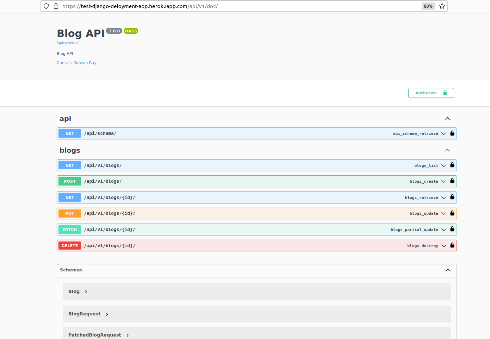

# Deploy Dockerised Django app to Heroku
This is the codebase to showcase deployment of a Django
app to heroku

# Setup & running locally

Create a .env file by copying the .env.sample provided and run:
```
docker compose build && docker compose up
```
to start the container. As an alternative, run:
```
docker compose -f docker-compose.dev.yml up --build
```
to build and run the container using the dev yaml file.
Make sure to externalize the db instance to be used. It can be in another container.

## Run tests
Run descriptive tests in the container using:
```
docker exec -it -w /app <container_name> pytest -rP -vv
```

Access the docs on:

```
http://localhost:10060/api/v1/doc
```


## Running In a Virtual Env

Create a virtual environment using:
```
mkvirtualenv <env_name>
```

Ensure you have installed `virtualenv` on your system and install dev dependencies using
```
pip install -r requirements/dev.txt
```

Run migrations using:
```
python manage.py makemigrations

python manage.py migrate
```

Run the server using:
```
python manage.py runserver
```

## Note:

Ideally, migration files should not be committed to repo so that individual dev can decide to play around with the database schema and run migrations as they wish locally.

But because we are currently deploying to heroku dynos which result to files between deployment not being
persisted, we are putting migrations here.

Steps:

- Run makemigrations & migrate locally using:

```bash
python manage.py makemigrations

python manage.py migrate
```

- Commit your code

- Push it to Heroku master and run:
``` bash
heroku run python manage.py migrate
```

